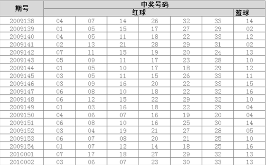

# 数据可视化

## 基本概念

数据可视化是指借助于图形化的手段，清晰、快捷有效的传达与沟通信息。同时，也可以辅助用户做出相应的判断，更好的去洞悉数据背后的价值。

## 字不如表，表不如图。

观察号码的频率，每个号码出现了多少次？

### 文字

08 10 15 20 30 31 33 06
01 09 10 17 21 28 32 13
02 05 08 13 19 21 28 10
03 05 07 14 18 23 25 07
…… ……

### 表格



### 图形

通过可视化图表方式，就可以清晰的表达信息。


### 可视化图形辅助决策

1854 年英国伦敦霍乱病流行时，斯诺博士在绘有霍乱流行地区所有道路、房屋、饮用水机井等内容的城区地图上，标出了每个霍乱病死者的住家位置，得到了霍乱病死者居住位置分布图，发现了霍乱病源之所在：布劳德大街（现布劳维克大街）的公用抽水机。


# matplotlib

matplotlib是用于Python的绘图库，提供各种常用图形的绘制。例如，条形图，柱形图，线图，散点图等。

## 安装

```
pip install matplotlib
```

## 导入

根据惯例，使用如下的方式导入：
`import matplotlib as mpl`
`import matplotlib.pyplot as plt`

## 图形绘制

### 绘制线图

可以通过matplotlib.pyplot的plot方法进行图形绘制。

- plot(y)

  - 只给y，则x默认为0,1,2,3……
  - 不给修饰，则不会显示点

  ```python
  plt.plot([10])
  ```

  

  .assets/image-20200109113157559.png)

- plot(y, '格式')

  - 格式可同时指定多个（看文档）`颜色|线型|点型`

  - 指定格式-`marker='o'`（点）

    ```python
    plt.plot([10],'o')
    ```

    .assets/image-20200109113502385.png)

  - 指定格式-`marker='-'`（线）

    ```python
    plt.plot([5,20],'-')#连线的形式-.为虚线
    ```

    .assets/image-20200109113731473.png)

- plot(x, y)

  - 指定x--横坐标

  - 对位取元素构成一个坐标，进行绘制

    ```python
    plt.plot([2,-1,5,6,7],[10,-2,6,23,10],'r->')
    ```

    .assets/image-20200109114737320.png)

- plot(x, y, '格式')

- plot(x1, y1, '格式1', x2, y2, '格式2' …… xn, yn, 格式n)

  - 合并写合并显示

    ```python
    x1 = [1,2,3,4]
    y1 = [2,3,4,5]
    x2 = [4,3,2,1]
    y2 = [2,3,4,5]
    plt.plot(x1,y1,'r-',x2,y2,'g-')
    ```

    .assets/image-20200109115205092.png)

  - 分开写再合并显示

    ```python
    x1 = [1,2,3,4]
    y1 = [2,3,4,5]
    x2 = [4,3,2,1]
    y2 = [2,3,4,5]
    plt.plot(x1,y1,'r-')
    plt.plot(x2,y2,'g--')
    ```

    .assets/image-20200109115314619.png)

  - 曲线(点比较密集)

    ```python
    x = np.linspace(0,2*np.pi,num=100)
    y = np.sin(x)
    plt.plot(x,y)
    ```

    .assets/image-20200109120049951.png)

### 图形交互式设置

我们可以设置jupyter notebook图形是否交互式显示，默认为否。

- %matplotlib notebook
- %matplotlib inline（默认嵌入）

### 设置中文支持

matplotlib默认情况下不支持中文显示，如果需要显示中文，则我们需要做一些额外的设置操作。设置可以分为：

- 全局设置
- 局部设置

#### 全局设置

+ 设置全局字体

  ```python
  mpl.rcParams["font.family"] = "FangSong"
  mpl.rcParams["axes.unicode_minus"]=False
  plt.plot([1,2,3],[4,5,-6])
  plt.title("标题")
  ```

  .assets/image-20200109121209876.png)

  + 字体`mpl.rcParams["font.family"] = "中文字体名称"`

  + 坐标负数显示`mpl.rcParams["axes.unicode_minus"]=False`

- font.family 字体的名称
  - sans-serif 西文字体（默认）
  - SimHei 中文黑体
  - FangSong 中文仿宋
  - YouYuan 中文幼圆
  - STSong 华文宋体
  - Kaiti 中文楷体
  - LiSu 中文隶书
- font.style 字体的风格
  - normal 常规（默认）
  - italic 斜体
  - oblique 倾斜
- font.size 字体的大小（默认10）
- axes.unicode_minus 是否使用Unicode的减号（负号）【在支持中文显示状态下，需要设置为False】

#### 局部设置

+ 需要显式的文字中，使用fontproperties参数进行设置。

  ```python
  plt.plot([1,2,3],[4,5,-6])
  plt.title("titile",fontsize=20)#临时性修改
  plt.title("恩恩",fontfamily='SimHei',fontsize=20)
  ```

+ 如果全局设置与局部设置冲突，以局部设置为准。

### 额外参数

#### 颜色，点标记与线型设置

我们可以在绘制图形时，显式指定图形的颜色，点标记或线条形状。具体设置可以查看帮助文档。

- color(c)：线条颜色。
- linestyle(ls)：线条形状。
- linewidth(lw)：线宽。
- marker：点标记形状。
- markersize(ms)：点标记的大小。
- markeredgecolor(mec)：点边缘颜色。
- markeredgewidth(mew)：点边缘宽度。
- markerfacecolor(mfc)：点的颜色。

```python
plt.plot([1,2,3],[4,5,6],
         c='g',
         ls='--',
         lw='2',
         marker='>',
         ms='15',
         mec='r',
         mew=3,
         mfc='b')
```

.assets/image-20200109143503994.png)

说明：

- 颜色，点标记与线型可以使用一个参数进行设置。
- 颜色除了可以使用预设简写的字符之外，也可以使用全称（例如red,green）也可以使用RGB颜色表示。

#### 透明度设置

在绘制图像时，我们可以通过alpha参数来控制图像的透明度，值在0 ~ 1之间。0为完全透明，1为不透明。

```python
plt.plot([1, 2, 3], [4, 5, 6], alpha=0.1)
plt.plot([4, 5, 6], [2, 4, 5])
```

.assets/image-20200109144017487.png)

### 图例设置

在绘制多条线时，可以设置图例来标注每条线所代表的含义，使图形更加清晰易懂。
可以采用如下的方式设置图例：

- 调用plt的legend函数，传递一个标签数组，按照绘图顺序指定每次plot图形的标签。

  ```python
  plt.plot(np.arange(1,13),np.random.randint(50,70,size=(12)))
  plt.plot(np.arange(1,13),np.random.randint(50,70,size=(12)))
  plt.legend(['2017年','2018年'])
  ```

  .assets/image-20200109144512356.png)

- 在绘制的时候通过label参数指定图例中显示的名称，然后调用legend函数生成图例。

  ```python
  mpl.rcParams["font.family"] = "FangSong"
  plt.plot(np.arange(1,13),np.random.randint(50,70,size=(12)),label='2017年')
  plt.plot(np.arange(1,13),np.random.randint(50,70,size=(12)),label='2018年')
  plt.legend()
  ```

  .assets/image-20200109144707394.png)

- legend常用的参数

  - loc：指定图例的位置。
    - 默认为best/0。(会选择最合适的位置进行显示)
    - 可以指定坐标（元组-基于图像尺寸偏移的比例），基于图像左下角计算。
  - frameon：设置是否含有边框。
  - title：设置图例的标题。
  - ncol：图例显示的列数，默认为1。

  ```python
  plt.plot(np.arange(1,13),np.random.randint(50,70,size=(12)),label='2017年')
  plt.plot(np.arange(1,13),np.random.randint(50,70,size=(12)),label='2018年')
  plt.legend(loc=(0,1),frameon=False,title='标题',ncol=2)
  ```

  .assets/image-20200109145602541.png)

### 网格设置

可以通过plt的grid方法来设置是否显示网格。True为显示，False不显示。

- color：设置网格线颜色
- axis：设置网格线显示x，y或者全部显示（x，y，both）。
- linestyle：设置网格线形状。
- linewidth：设置网格线宽度。

```python
plt.plot([1,2,3],[4,5,6])
plt.grid(True,color='r',axis='y',linestyle='--',linewidth=2)
```

.assets/image-20200109150819212.png)

### 绘图区域设置

我们可以在一张图上绘制多个图形，当然，我们也可以将不同的图形绘制到多个不同的区域当中。
我们可以采用以下方式来实现多个区域的绘制（创建子绘图区域）：

- 通过Figure对象调用add_subplot方法。
- 通过plt的subplot方法。
- 通过plt的subplots方法。

#### 子区域1：add_subplot方法

- 首先创建matplotlib.figure.Figure对象，然后通过Figure对象的add_subplot方法增加子绘图区域。

  - 在绘制图形时，总是需要创建Figure对象。
  - 如果没有显式创建，则plt会隐式创建一个Figure对象。

- 在绘制图形时，既可以使用plt来绘制，也可以使用子绘图对象来绘制。

  - 如果使用plt对象绘制，则总是在最后创建的绘图区域上进行绘制
  - 如果此时尚未创建绘图区域，则会自动创建。

  ```python
  f = plt.figure()
  f.add_subplot('121')
  plt.plot([1,2,3],[3,4,5])#一一对应
  f.add_subplot('122')
  plt.plot([11,21,3],[-13,-14,-15])
  ```

  .assets/image-20200109191130782.png)

- add_subplot方法参数

  - 子区域的行数

  - 列数

  - 当前绘制的子区域的位置索引（从1开始）。

  - 也可以通过字符串的形式，进行传递参数。（将三个参数合并到一起）

    ```python
    f = plt.figure()
    ax1 = f.add_subplot('121')
    ax2 = f.add_subplot('122')
    ax1.plot([1,2,3],[3,4,5])
    ax2.plot([11,21,3],[-13,-14,-15])
    ```

- add_subplot方法会返回子绘图对象（轴对象），通过该对象即可实现绘图（matplotlib.axes._subplots.AxesSubplot）。

  ```python
  f = plt.figure()
  ax1 = f.add_subplot(1,2,1)
  ax2 = f.add_subplot(1,2,2)
  ax1.plot([1,2,3],[3,4,5])
  ax2.plot([11,21,3],[-13,-14,-15])
  ```

  .assets/image-20200109190544804.png)

- 可以通过plt.subplots_adjust方法来调整子绘图的位置与子绘图之间的距离。（left, right, top, bottom, wspace, hspace）

  ```python
  f = plt.figure()
  a = f.add_subplot('121')
  b = f.add_subplot('122')
  a.plot([1,2,3],[3,4,5])
  b.plot([11,21,3],[-13,-14,-15])
  f.subplots_adjust(wspace=0.5,hspace=0.5)#或plt.subplots_adjust
  ```

  .assets/image-20200109191742716.png)

- 创建子区域时，可以使用facecolor设置绘图区域的背景色。

  ```python
  f = plt.figure()
  a = f.add_subplot('121',facecolor='r')
  b = f.add_subplot('122',facecolor='g')
  a.plot([1,2,3],[3,4,5])
  b.plot([11,21,3],[-13,-14,-15])
  ```

  .assets/image-20200109192340685.png)

#### 子区域2：subplot方法

+ 调用plt的subplot方法创建子绘图区域，该方法返回子绘图对象。
+ 此处方式下，会隐式创建Figure对象。
+ 这种创建子绘图区域的方式，底层也是通过第一种方式实现的。

```python
a = plt.subplot('121')
b = plt.subplot('122')
a.plot([1,2,3],[3,4,5])
b.plot([11,21,3],[-13,-14,-15])
```

.assets/image-20200109192612768.png)

#### 子区域3：subplots方法

+ 通过plt的subplots方法创建子绘图区域，该方法返回一个元组(两个元素)

  ```python
  figure, ax = plt.subplots(2,2)
  ax[0,0].plot([1,2,3],[4,5,6])
  ax[0,1].plot([-1,-2,-3],[4,5,6])
  ```

  .assets/image-20200109193418794.png)

  + Figure对象

  + 所有创建好的子绘图区域对象，如果是多个子绘图对象，则返回一个ndarray数组

  + 对于多维的情况可以使用ravel()压平后循环赋值

    ```python
    figure, ax = plt.subplots(2,2)
    for i in range(ax.size):
        ax.ravel()[i].plot([1,2,3],[4,5,6])
    ```

    .assets/image-20200109193847785.png)

+ 可以通过sharex与sharey来指定是否共享x轴与y轴（默认为False）。

  ```python
  figure, ax = plt.subplots(1,2,sharex=True,sharey=True)
  ax[0].plot([1,2,3],[4,5,6])
  ax[1].plot([4,5,6],[24,25,26])
  ```

  .assets/image-20200109194325146.png)


## 保存与读取图表

#### 保存

##### 保存到本地硬盘

通过plt的savefig方法将当前的图形保存到硬盘或者类文件对象中。

```python
x = np.linspace(0,2*np.pi,num=1000)
y = np.sin(x)
plt.plot(x,y,'-')
plt.savefig(r'C:\Users\24479\Desktop\1.jpg')
```

- dpi：每英寸分辨率点数。（即水平/垂直分辨率）
- facecolor：设置图像的背景色。
  - 颜色字母开头`g`
  - rgb16进制形式
- bbox_inches：设置为tight，可以紧凑保存图像(边距小)。

```python
x = np.linspace(0,2*np.pi,num=1000)
y = np.sin(x)
plt.plot(x,y,'-')
plt.savefig(r'C:\Users\24479\Desktop\1.jpg',dpi=100,facecolor='g',bbox_inches='tight')
```

.assets/image-20200109141004987.png)

##### 保存到类文件对象中

```python
from io import BytesIO
bio = BytesIO()
x = np.linspace(0,2*np.pi,num=1000)
y = np.sin(x)
plt.plot(x,y,'-')
plt.savefig(bio)
bio.getvalue()
```

#### 读取

+ 使用pillow库`from PIL import Image`

+ 读取并显示（使用系统默认的浏览工具）

  ```python
  image = Image.open(r'C:\Users\24479\Desktop\1.jpg')
  image.show()
  ```

+ 从缓存中读取

  ```python
  from io import BytesIO
  bio = BytesIO()
  x = np.linspace(0,2*np.pi,num=1000)
  y = np.sin(x)
  plt.plot(x,y,'-')
  plt.savefig(bio)
  bio.getvalue()
  image = Image.open(bio)
  image.show()
  ```

  