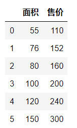
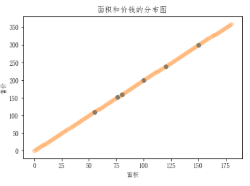
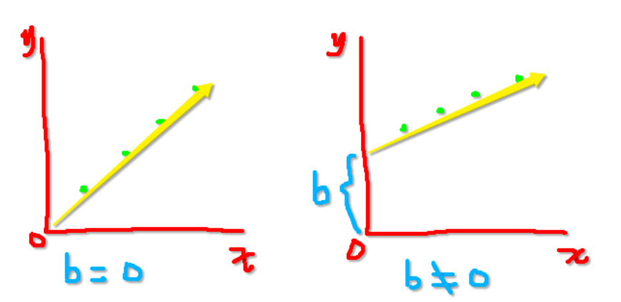
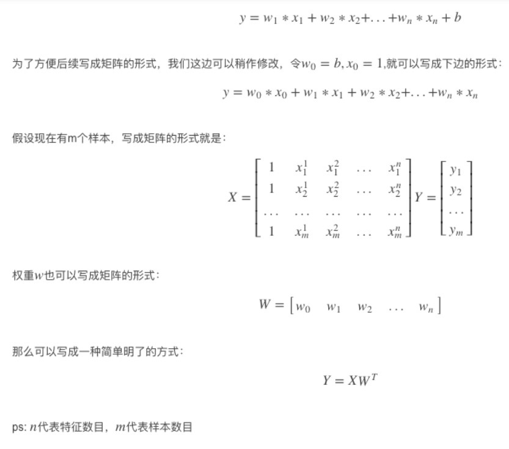
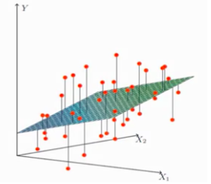
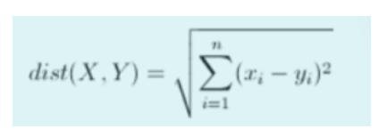
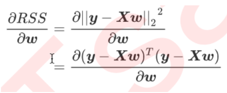
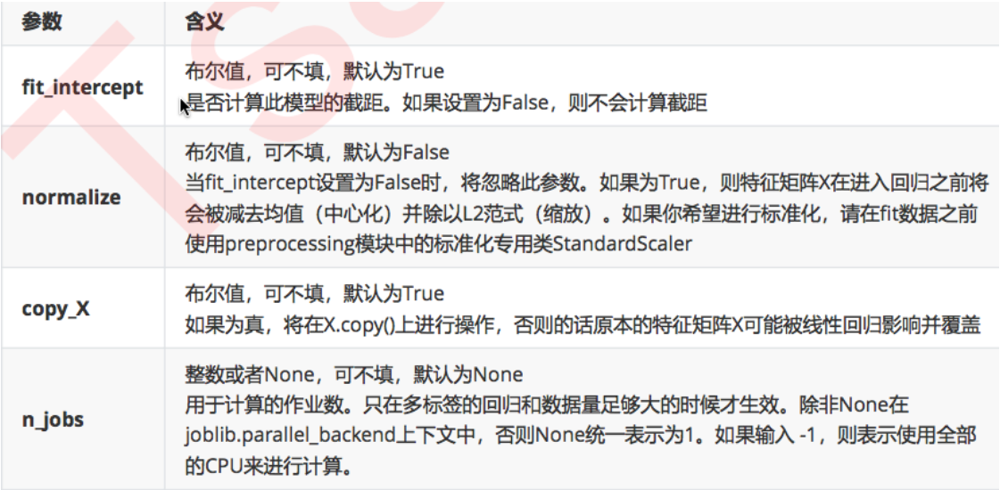
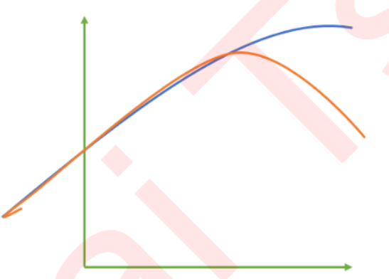

## 线性回归

### 初识

- 回归问题的判定

  > 目标值是连续性的值，而分类问题的目标值是离散型的值。

- 回归处理的问题为预测

  - 预测房价
  - 销售额的预测
  - 设定贷款额度
  - 总结：上述案例中，可以根据事物的相关特征预测出对应的结果值

- 线性回归在生活中的映射：生活案例【预测学生的期末成绩】

  - 期末成绩的制定：0.7*考试成绩+0.3平时成绩，则该例子中，特征值为考试成绩和平时成绩，目标值为总成绩。从此案例中大概可以感受到
    - 回归算法预测出来的结果其实就是经过相关的算法计算出来的结果值！
    - 每一个特征需要有一个权重的占比，这个权重的占比明确后，则就可以得到最终的计算结果，也就是获取了最终预测的结果了。
      - 那么这个特征对应的权重如何获取或者如何制定呢？

- 售房数据的分析

  - 售房的数据展示

    ```python
    #现在有一组售房的数据
    import numpy as np
    import pandas
    from pandas import DataFrame
    import matplotlib.pylab as plt
    dic = {
        '面积':[55,76,80,100,120,150],
        '售价':[110,152,160,200,240,300]
    }
    df = DataFrame(data=dic)
    df
    ```

    

  - 对售房数据的分布情况进行展示

    ```python
    from pylab import mpl
    mpl.rcParams['font.sans-serif'] = ['FangSong'] # 指定默认字体
    mpl.rcParams['axes.unicode_minus'] = False # 解决保存图像是负号'-'显示为方块的问题
    
    plt.scatter(df['面积'],df['售价'])
    plt.xlabel('面积')
    plt.ylabel('售价')
    plt.title('面积和价钱的分布图')
    ```

    

  - 问题：假如现在有一套房子，面积为76.8平米，那么这套房子应该卖多少钱呢？也就是如何预测该套房子的价钱呢？

    > 上图中散点的分布情况就是面积和价钱这两个值之间的关系，那么如果该关系可以用一个走势的直线来表示的话，那么是不是就可以通过这条走势的直线预测出新房子的价格呢？

    ```python
    #忽略代码只看绘制出的图
    plt.scatter(df['面积'],df['售价'])
    plt.xlabel('面积')
    plt.ylabel('售价')
    plt.title('面积和价钱的分布图')
    plt.scatter(np.linspace(0,180,num=100),np.linspace(0,180,num=100)*2,alpha=0.3)
    ```

    

    > 上图中发现，该直线是穿过了所有的散点，那么如果已有的散点的分布没有这么规律的话，这条直线就无法穿过所有散点，怎么办呢？

  - 先来研究目前这种简单的情况

    - 散点的趋势

      > 在上图中使用了一条直线来表示了房子的价格和面子对应的分布趋势，那么该趋势找到后，就可以基于该趋势根据新房子的面积预测出新房子的价格。

    - 线性回归的作用

      > 就是找出特征和目标之间存在的某种趋势！！！在二维平面中，该种趋势可以用一条线段来表示。

  - 变化趋势的表示方式--------**线性方程**

    - 在数学中，线性方程y = wx就可以表示一条唯一的直线。那么在上述售房数据中，面积和价格之间的关系（二倍的关系）其实就可以映射成

      > 价格 = 2 * 面积 ==》y=2x，这个方程就是价格和面积的趋势！也就是说根据该方程就可以进行新房子价格的预测

    - 标准的线性方程式为：y = wx + b,w为斜率，b为截距。那么如果用线性方程表示房价和面积的趋势的话，这个b是否需要带上呢？

      

      > 是否带上b，得具体情况具体分析。y=wx,如果x为0，则y必定为0，那就意味着趋势对应的直线必过坐标系的原点（0，0），如果带上b值，则直线不过原点。如果上有图的趋势直线过原点的话，趋势就会不准。加b的目的是为了使得趋势对应的直线更加具有通用性！！！

      > 如果目标值有可能为0的话，就带上b，否则不带b。

  - 思考：上述的线性方程y=wx+b其中x为特征y为目标，这种方程作为线性关系模型的预测依据的话是否可以满足所有的预测场景呢？

    - 如果现在房价受影响的因素不光是面积了，加入了采光率和楼层了，那么就意味着特征变成了3种。在原始的线性方程y=wx+b中只可以有一个特征，则该方程不具备通用性。

    - 标准线性关系模型为

      >`面积 = （w1*面积+w2*采光率+w3*楼层）+ b`
      >
      >==》`y = (w1*x1*w2*x2+wn*xn)+b`

      - w又叫做权重。

      - b可以变换成w0*x0,x0=1

        > y = w0*x0+w1*x1+w2*x2+wn*xn

      - 权重向量：w0,w1,...wn

      - 特征向量：x0,x1,...xn

### 算法分析

+ 线性方程式

  > 找出特征和特征权重之间的一种组合，从而来预测对应的结果！！！

  

+ 问题：真实结果和预测结果是否会存在误差？

  > 答：在多数的预测中都会和真实值存在一定的误差！

  

+ 误差存在，那我们如何处理误差呢？在处理误差之前，我们必须先要知道一个回归算法的特性

  - 回归算法是一个迭代算法。所谓的迭代就好比是系统版本的迭代，迭代后的系统要比迭代前的系统更好。
    - 当开始训练线性回归模型的时候，是逐步的将样本数据带入模型对其进行训练的。
    - 训练开始时先用部分的样本数据训练模型生成一组w和b，对应的直线和数据对应散点的误差比较大，通过不断的带入样本数据训练模型会逐步的迭代不好（误差较大）的w和b从而使得w和b的值更加的精准。
  - 官方解释：迭代是重复反馈过程的活动，其目的通常是为了逼近所需目标或结果。每一次对过程的重复称为一次“迭代”，而每一次迭代得到的结果会作为下一次迭代的初始值。

+ 误差的处理方法

  > 通俗点来说，回归算法就是在不断的自身迭代的减少误差来使得回归算法的预测结果可以越发的逼近真实结果！！！


- 如何不断迭代的减少误差呢？

  - 通过【损失函数】来表示误差

    

    - yi：为第i个训练样本的真实值
    - hw(xi):预测值
      - 误差的大小和我们线性回归方程中的哪个系数有直系的关联呢？
        - w（权重）
        - 那么最终的问题就转化成了，【如何去求解方程中的w使得误差可以最小】

  - 损失函数也可以表示为

    

  - L2范式

    - 这个损失函数代表了向量yi-y^i 的L2范式的平方结果，L2范式的本质是就是欧式距离，即是两个向量上的每个点对应相减后的平方和再开平方，我们现在只实现了向量上每个点对应相减后的平方和，并没有开方，所以我们的损失函数是L2范式，即欧式距离的平方结果。

      

    - 在这个平方结果下，我们的y和y^分别是我们的真实标签和预测值，也就是说，这个损失函数实在计算我们的真实标签和预测值之间的距离。因此，我们认为这个损失函数衡量了我们构造的模型的预测结果和真实标签的差异，因此我 们固然希望我们的预测结果和真实值差异越小越好。所以我们的求解目标就可以转化为:

      

    - SSE&RSS

      > 其中右下角的2表示向量y-Xw的L2范式，也就是我们的损失函数所代表的含义。在L2范式上开平方，就是我们的损失函数。我们往往称 呼这个式子为SSE(Sum of Sqaured Error，误差平方和)或者RSS(Residual Sum of Squares 残差平方和)。

- 最小二乘法

  - 现在问题转换成了求解让RSS最小化的参数向量w，这种通过最小化真实值和预测值之间的RSS来求解参数的方法叫做最小二乘法。

  - 求解极值（最小值）的第一步往往是求解一阶导数并让一阶导数等于0，最小二乘法也不能免俗。因此，我们现在在残差平方和RSS上对参数向量w求导。

  - 首先w表示的是一个列向量（矩阵），我们现在并非是对常数求导，而是对列向量（矩阵）进行求导。矩阵求导的自行掌握即可。

  - 首先将L2范式拆开

    

    >两个向量（y&Xw）的平方就等于两个向量的转置乘以两个向量本身。

  - 处理转置乘法和减法

    

  - 然后将上图的分子进行多项式相乘

    

  - 然后公式就变相为yTy对w求导，wTXTy对w的求导，yTXw对w的求导，wTXTXw对w的求导。这里的w为列向量(矩阵)则就涉及到对矩阵的求导

    - 在矩阵求导中如果小a为常数项，A为矩阵则

      

    - 由于y是一个列向量，为一阶矩阵，那么其本身乘以其转置为一个常数！

  - 分子上的每一项对w进行求导后的结果为

    

    > 至此我们就求解出了对w求导的一阶导数，接下来让一阶导数为0则就求出了最小误差下的w的值了。

    

### 模型使用

#### 接口调用

+ API

  - 最小二乘（正规方程）：from sklearn.linear_model import LinearRegression
  - `coef_`属性返回的就是最小误差下对应的w
  - `intercept_` 返回截距

+ 最小二乘法

  

  > 这些参数中并没有一个是必填的，更没有对我们的模型有不可替代作用的参数。这说明，线性回归的性能，往往取决于数据本身，而并非是我们的调参能力，线性回归也因此对数据有着很高的要求。幸运的是，现实中大部分连续型变量之间，都存在着或多或少的线性联系。所以线性回归虽然简单，却很强大。顺便一提，sklearn中的线性回归可以处理多标签问题，只需要在fit的时候输入多维度标签就可以了。

+ 使用最小二乘对加利福尼亚房屋进行预测

  + 特征介绍

    - AveBedrms:该街区平均的卧室数目
    - Population:街区人口
    - AveOccup:平均入住率
    - Latitude:街区的纬度
    - Longitude:街区的经度
    - MedInc:街区住户收入的中位数
    - HouseAge：房屋使用年数中位数
    - AveRooms：街区平均房屋的数量

  + 获取数据

    ```python
    from sklearn.linear_model import LinearRegression
    from sklearn.model_selection import train_test_split
    from sklearn.model_selection import cross_val_score
    from sklearn.datasets import fetch_california_housing as fch #加利福尼亚房屋价值数据集 
    import pandas as pd
    #下载数据
    feature = fch().data
    target = fch().target
    #样本数据提取（封装到df中查看）
    df = pd.DataFrame(data=feature,columns=fch().feature_names)
    df['price'] = target
    df.head()
    ```

    

  + 拆分数据

    ```python
    x_train,x_test,y_train,y_test = train_test_split(feature,target,random_state=2020,test_size = 0.1)
    ```

  + 训练模型：让模型求出误差最小对应最优的w

    ```python
    #建模
    linner = LinearRegression(fit_intercept=True)
    linner.fit(x_train,y_train)
    
    linner.coef_ #误差最小对应的w
    ------------------
    array([ 4.38210243e-01,  9.66229111e-03, -1.08329143e-01,  6.52754576e-01,
           -4.79939625e-06, -3.60231961e-03, -4.21938498e-01, -4.34993681e-01])
    ------------------
    linner.intercept_ #截距 -36.99211044654083
    #将系数和特征名称结合在一起查看
    [*zip(fch().feature_names,linner.coef_)]
    -------------------
    [('MedInc', 0.4382102431938418),
     ('HouseAge', 0.00966229110734124),
     ('AveRooms', -0.10832914332769084),
     ('AveBedrms', 0.6527545761249733),
     ('Population', -4.799396252223811e-06),
     ('AveOccup', -0.003602319606308055),
     ('Latitude', -0.42193849756433377),
     ('Longitude', -0.43499368106442565)]
    ```

  + 问题思考

    + 线性回归中通常是否需要对特征数据进行预处理（归一化，标准化）？

      > 先不做，如果模型的评分不好，可以尝试做一下。

    + 是否需要进行交叉验证？

      - 在knn中我们做交叉验证是为可画出学习曲线找出最优的超参数（k）
      - 一般不需要做交叉验证，因为线性模型没有超参数

#### 误差分析

+ 回归模型的评价指标

  > 回归类算法的模型评估一直都是回归算法中的一个难点，回归类与分类型算法的模型评估其实是相似的法则— —找真实标签和预测值的差异。只不过在分类型算法中，这个差异只有一种角度来评判，那就是是否预测到了正确的分类，而在我们的回归类算法中，我们有两种不同的角度来看待回归的效果:

  - 第一，我们是否预测到了正确的数值。
  - 第二，我们是否拟合到了足够的信息。
  - 这两种角度，分别对应着不同的模型评估指标。

+ #### 是否预测到了正确的数值

  + 回忆一下我们的RSS残差平方和，它的本质是我们的预测值与真实值之间的差异，也就是从第一种角度来评估我们回 归的效力，所以RSS既是我们的损失函数，也是我们回归类模型的模型评估指标之一。但是，RSS有着致命的缺点: 它是一个无界的和，可以无限地大或者无限的小。我们只知道，我们想要求解最小的RSS，从RSS的公式来看，它不能为负，所以 RSS越接近0越好，但我们没有一个概念，究竟多小才算好，多接近0才算好?为了应对这种状况，sklearn中使用RSS 的变体，均方误差MSE(mean squared error)来衡量我们的预测值和真实值的差异:

    

  + 均方误差，本质是在RSS的基础上除以了样本总量，得到了每个样本量上的平均误差。有了平均误差，我们就可以将 平均误差和我们的标签的取值范围（最大值和最小值）在一起比较，以此获得一个较为可靠的评估依据。（查看这个错误有多严重）

  + 在sklearn当中，我们有两种方式调用这个评估指标

    - 一种是使用sklearn专用的模型评估模块metrics里的类mean_squared_error

      ```python
      #模块实现的均方误差
      from sklearn.metrics import mean_squared_error as MSE
      MSE(y_test,linner.predict(x_test))
      #真实值和预测值的均方误差为 0.5273022319571903
      ```

    - 另一种是调用 交叉验证的类cross_val_score并使用里面的scoring参数来设置为：neg_mean_squared_error使用均方误差。

      ```python
      cross_val_score(linner,x_train,y_train,cv=10,scoring="neg_mean_squared_error").mean()
      #-0.5287074454857323
      ```

      >均方误差的计算公式中求得的均方误差的值不可能为负。但是sklearn中的参数scoring下，均方误差作为评判标准时，却是计算”负均方误差“(neg_mean_squared_error)。这是因为sklearn在计算模型评估指标的时候，会考虑指标本身的性质，均方误差本身是一种误差，所以被sklearn划分为模型的一种损失(loss)。在sklearn当中，所有 的损失都使用负数表示，因此均方误差也被显示为负数了。真正的均方误差MSE的数值，其实就是neg_mean_squared_error去掉负号的数字。

+ 绝对值误差（了解）

  - 除了MSE，我们还有与MSE类似的MAE(Mean absolute error，绝对均值误差)

    

  - 其表达的概念与均方误差完全一致，不过在真实标签和预测值之间的差异外我们使用的是L1范式(绝对值)。现实使 用中，MSE和MAE选一个来使用就好了。

    - 在sklearn当中，我们使用命令
      - from sklearn.metrics import mean_absolute_error来调用MAE，
    - 同时，我们也可以使用交叉验证中的
      - scoring = "neg_mean_absolute_error"， 以此在交叉验证时调用MAE。

  - RMSE的使用

    - rmse = np.sqrt(metrics.mean_squared_error(y_true,y_pred))

+ #### 是否拟合了足够的信息

  + 对于回归类算法而言，只探索数据预测是否准确是不足够的。除了数据本身的数值大小之外，我们还希望我们的模型能够捕捉到数据的”规律“，比如数据的分布规律（抛物线），单调性等等。而是否捕获到这些信息是无法使用MSE来衡量的。

  + 来看这张图，其中红色线是我们的真实标签，而蓝色线是我们的拟合模型。这是一种比较极端，但的确可能发生的情况。这张图像上，前半部分的拟合非常成功，看上去我们的真实标签和我们的预测结果几乎重合，但后半部分的拟合 却非常糟糕，模型向着与真实标签完全相反的方向去了。对于这样的一个拟合模型，如果我们使用MSE来对它进行判 断，它的MSE会很小，因为大部分样本其实都被完美拟合了，少数样本的真实值和预测值的巨大差异在被均分到每个样本上之后，MSE就会很小。但这样的拟合结果必然不是一个好结果，因为一旦我的新样本是处于拟合曲线的后半段的，我的预测结果必然会有巨大的偏差，而这不是我们希望看到的。所以，我们希望找到新的指标，除了判断预测的数值是否正确之外，还能够判断我们的模型是否拟合了足够多的，数值之外的信息。

    

  + 在我们学习降维特征选择的时候，我们提到我们使用方差来衡量数据上的信息量。如果方差越大，代表数据上的信息 量越多，而这个信息量不仅包括了数值的大小，还包括了我们希望模型捕捉的那些规律。为了衡量模型对数据上的信 息量的捕捉，我们定义了R2来帮助我们

    

    

  + 可以使用三种方式来调用

    - 一种是直接从metrics中导入r2_score，输入预测值和真实值后打分。

      ```python
      from sklearn.metrics import r2_score 
      r2_score(y_test,linner.predict(x_test))#0.6097458147785062
      ```

    - 第二种是直接从 线性回归LinearRegression的接口score来进行调用。

      ```python
      r2 = linner.score(x_test,y_test)
      r2#0.6097458147785062
      ```

    - 第三种是在交叉验证中，输入"r2"来调用。

      ```python
      cross_val_score(linner,x_train,y_train,cv=10,scoring='r2').mean()#0.6012662971377255
      ```

  + 绘制拟合图

    ```python
    %matplotlib inline
    import matplotlib.pyplot as plt
    y_pred = linner.predict(x_test)
    plt.figure(figsize=(8,8))
    plt.plot(range(len(y_test)),sorted(y_test),c="black",label= "y_true")
    plt.plot(range(len(y_pred)),sorted(y_pred),c="red",label = "y_predict")
    plt.legend()
    plt.show()
    ```

    

    > 可见，虽然我们的大部分数据被拟合得比较好，但是图像的开头和结尾处却又着较大的拟合误差。如果我们在图像右侧分布着更多的数据，我们的模型就会越来越偏离我们真正的标签。这种结果类似于我们前面提到的，虽然在有限的数据集上将数值预测正确了，但却没有正确拟合数据的分布，如果有更多的数据进入我们的模型，那数据标签被预测错误的可能性是非常大的。