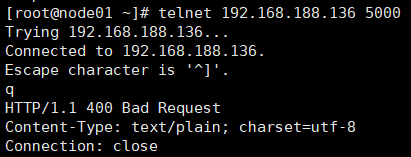
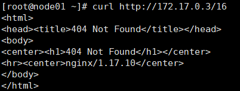
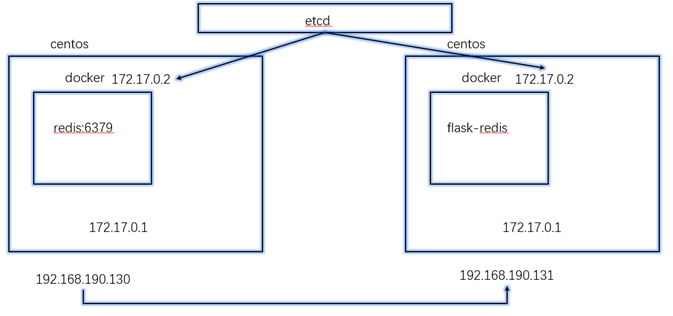
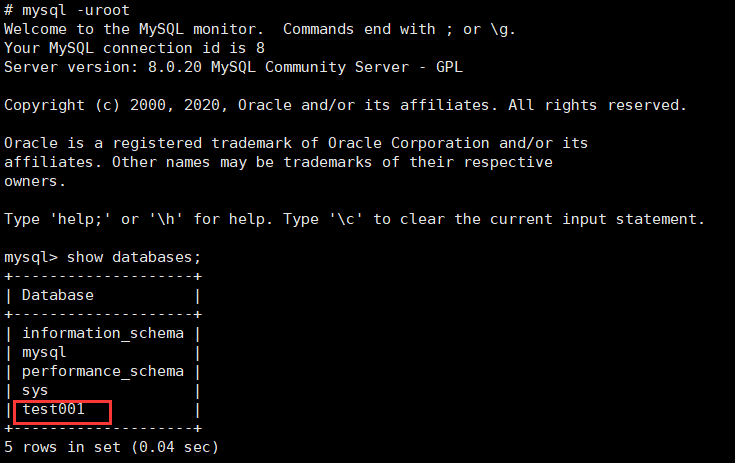
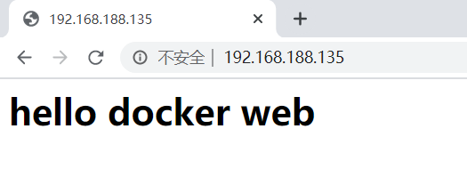

# Docker 介绍

*Docker*是一款于安装部署项目运营时需要的软件和依赖的工具，类似于VMware虚拟机平台。

docker可以通过git从docker官网仓库中下载各种各样的镜像到本地，然后可以通过命令，对镜像进行操作。

# Docker 安装

+ 官网：https://docs.docker.com/
+ Docker 提供了两个版本：社区版 (CE) 和企业版 (EE)
+ docker palyground
  + 地址：https://labs.play-with-docker.com/
  + 直接使用云端的docker

## ubuntu安装

> 更新ubuntu的apt源索引

```shell
sudo apt-get update
```

> 安装包允许apt通过HTTPS使用仓库

```shell
sudo dpkg --configure -a
sudo apt-get install apt-transport-https ca-certificates curl software-properties-common
```

> 添加Docker官方GPG key【这个是国外服务器地址，所以网路不好的时候，会失败！在网路好的情况下，多执行几次就没问题了】

```shell
curl -fsSL https://download.docker.com/linux/ubuntu/gpg | sudo apt-key add -
```

> 设置Docker稳定版仓库

```shell
sudo add-apt-repository "deb [arch=amd64] https://download.docker.com/linux/ubuntu $(lsb_release -cs) stable"
```

> 添加仓库后，更新apt源索引

```shell
sudo apt-get update
```

> 前面的准备工作完成以后，接下来安装最新版Docker CE（社区版）

```shell
sudo apt-get install docker-ce
```

> 检查Docker CE是否安装正确

```shell
sudo docker run hello-world
```

> 出现了`helo from Docker`则表示上面的安装成功！


我们获取镜像文件，可以直接去官方网站上获取: https://hub.docker.com/

## centos安装

> 卸载旧的版本

```shell
yum remove docker \
docker-client \
docker-client-latest \
docker-common \
docker-latest \
docker-latest-logrotate \
docker-logrotate \
docker-selinux \
docker-engine-selinux \
docker-engine
```

> 安装依赖

```shell
yum install -y yum-utils \
device-mapper-persistent-data \
lvm2
```

> 添加repository

```shell
yum-config-manager \
--add-repo \
https://download.docker.com/linux/centos/docker-ce.repo
```

> 查询可以装什么docker版本

```shell
yum list docker-ce --showduplicates | sort -r
```

> 安装指定版本

```shell
yum -y install docker-ce-18.06.1.ce-3.el7
```

> 查看版本信息

```shell
docker version
```

# Docker 命令

## 通用命令

### 查看docker 当前版本

```shell
docker --version  # 查看整个docker的版本。
docker version
```

### 启动docker

```bash
# 启动docker
sudo service docker start

# 停止docker
sudo service docker stop

# 重启docker
sudo service docker restart

#设置开机自启
systemctl enable docker
```


## 镜像操作[image]

### 列出所有镜像

```shell
docker image ls
# 上面的命令时省略了 --all
docker image ls --all
```

> 根据镜像id，查看到镜像分层信息

```shell
docker history <镜像名称:版本号>
```

### 拉取镜像

下载镜像，默认从官网镜像库下载镜像的，也可以修改docker的源，让docker从国内其他镜像库下载镜像回来。

这可以达到下载加速的作用。

例如，使用阿里云的镜像源：

```shell
sudo vim /etc/docker/daemon.json   # 文件如果不存在，则创建
# 添加如下内容：


{
  "registry-mirrors": ["https://2xdmrl8d.mirror.aliyuncs.com"]
}
或者
{
"registry-mirrors": [
"https://kfwkfulq.mirror.aliyuncs.com",
"https://2lqq34jg.mirror.aliyuncs.com",
"https://pee6w651.mirror.aliyuncs.com",
"https://registry.docker-cn.com",
"http://hub-mirror.c.163.com"
],
"dns": ["8.8.8.8","8.8.4.4"]
}
# 重启docker即可。

```

如果不指定版本号，默认拉取最新版本的镜像

```shell
docker image pull <镜像名称:版本号>
```

### 删除镜像

删除的时候，必须注意是否有容器在运行当前镜像文件，如果在使用，则需要先删除容器，才能删除镜像

```shell
docker image rm <镜像名称/镜像ID>:版本号
```

删除的镜像如果被容器提前使用了，则错误如下：


### 制作镜像

> 创建源文件,命名固定

```shell
vim Dockerfile
```

> 写入内容

```shell
FROM ubuntu
CMD echo "hello my"
```

> 编译镜像

```shell
docker build -t my/hello-world .
```

### 把docker中的镜像打包成文件

用于分享发送给他人，或备份

```shell
docker save -o <文件名.tar.gz>  <镜像名>
```

### 把镜像文件加载到docker中

```shell
docker load -i <文件名.tar>
```

### Dockerfile详解

+ FROM：从哪开始，从一个系统开始

  ```shell
  FROM scratch         # 最小系统
  FROM centos         
  FROM ubuntu:14.04
  ```

+ LABEL：注释

  ```shell
  LABEL version=”1.0”
  LABEL auther=”sjc”
  ```

+ RUN：执行命令，每RUN一次，会多一个系统分层，尽量少一些层

  ```shell
  RUN yum -y update && install lrzsz \ 
  net-tools
  ```

+ WORKDIR：进入或创建目录，尽量不要用相对路径

  ```shell
  WORKDIR /root     # 进入 /root 目录
  WORKDIR /test     # 会在根下，创建 /test 并进入
  WORKDIR demo    # 创建demo，进入
  RUN pwd          # /test/demo
  ```

+ ADD and COPY：将本地的文件，添加到image里，COPY和ADD区别是不会解压

  ```shell
  ADD hello /  # 将当前目录下hello，添加到容器的根下
  ADD tt.tar.gz /  # 压缩包扔进去，并解压
  ```

+ ENV，增加Dockerfile的可读性，健壮性

+ CMD and ENTRYPOINT：执行命令或运行某个脚本

  + Shell和Exec格式

    ```shell
    FROM centos
    #shell格式
    CMD echo "hello docker"
    #exec格式
    CMD ["/bin/echo","hello docker"]
    ENTRYPOINT ["/bin/echo","hello docker"]
    ```

  + ENTRYPOINT与CMD：容器启动时，运行什么命令

    ```shell
    ENTRYPOINT ["docker-entrypoint.sh"]
    CMD ["mysqld"]
    ```

    **ENTRYPOINT比CMD用的多，因为CMD有可能执行完前面的，把后面定义的CMD给忽略不执行了**

## 容器操作[container]

### 创建容器

必须先有镜像，才能运行创建容器，需要指定使用的镜像名，并且设置创建容器以后，执行对应的第一条命令 ，

如果本地不存在则去仓库下载创建。

```shell
docker run <参数选项> <镜像名称> <命令>
```

例如：使用"hello-world"镜像，创建一个容器，但没有进行任何操作

```shell
docker run hello-world
```

例如：使用ubuntu镜像，创建一个名为ubuntu1

```
docker pull ubuntu:18.04
docker run -it --name=ubuntu1 ubuntu:18.04 bash
```

注意：必须启动的时候，让容器运行bash解析器，才能在接下来的操作让容器不会立刻关闭，而且也能够让我们可以输入linux终端命令， 如果我们一般创建一个容器，选项都是： -itd

### docker run的选项

> -t    表示容器启动后会进入其命令行终端

> -i     表示以“交互模式”运行容器

> --name  表示设置容器的名称

> -d    创建一个守护式容器在后台运行(这样创建容器后不会自动登录容器，如果只加-i -t 两个参数，创建后就会自动进去容器)

> -p    指定端口映射，格式为：**主机(宿主)端口:容器端口**

> -e 变量名="变量值"   设置环境变量

> --network=host    指定容器的网络连接类型

> --restart=always   在docker重启的时候，是否要自动重启容器

> -v 把docker外接的目录和指定容器内部的目录进行映射，共享文件

例如，使用ubuntu镜像，创建一个名为ubuntu，并且在后台运行的容器像

```
docker run -itd --name=ubuntu ubuntu<:版本>
```

### 列出所有容器

```shell
docker container ls                      # 所有正在启动运行的容器

docker container ls --all                # 所有容器[不管是否在启动运行中]
```

### 启动容器

> 可以同时启动多个容器，容器之间使用空格隔开

```shell
# 启动一个容器
docker container start <容器名称/容器ID>

# 启动多个容器
docker container start <容器名称/容器ID>  <容器名称/容器ID> <容器名称/容器ID>

#查看运行时的容器的运行日志
docker logs <容器名称/容器ID>

#查看运行时容器详细信息
docker inspect <容器名称/容器ID>
```

### 停止容器

```shell
docker container stop <容器名称/容器ID>
```

### 杀死容器

在容器无法停止的时使用[强制关机，相当于电源]

```shell
docker container kill <容器名称/容器ID>
```

### 进入容器

要进入容器，必须当前容器是启动状态的

```shell
docker container exec -it <容器名称/容器ID>  <第一个命令>
```

**注意：第一个命令根据镜像决定（常用bash）**

### 删除容器

> 删除某个容器

```shell
docker  container rm <容器名称/容器ID>
```

> 删除所有容器

```shell
docker rm $(docker container ls -aq)
```

> 删除没有在运行的容器

```shell
docker rm $(docker container ls -f "status=exited" -q)
```

### 复制文件

+ 语法  

  >docker cp  原地址:新地址

+ 使用

  1. 从外界复制文件到指定容器中

     ```shell
     sudo docker container cp <路径/文件名>  <容器名称/容器ID>:<路径/文件名>
     ```

  2. 从容器内部复制文件到外界来

     ```shell
     sudo docker container cp <容器名称/容器ID>:<路径/文件名>  <路径/文件名>
     ```

### 把容器保存成镜像

```shell
docker commit <容器名称/容器ID>  <新镜像名>:<版本号>
```


## 其它操作

### 搭建私有docker registry

> github是公开的，也可以创建自己的私有仓库，docker官方给提供了私有仓库的镜像

1. 准备第二台机器，作为私有仓库,第二台运行如下

   ```shell
   docker run -d -p 5000:5000 --restart always --name registry registry:2
   ```

   > 查看进程，运行没问题

   

   > 浏览器可以看到第二台机器仓库里，没东西
   >
   > <http://192.168.188.136:5000/v2/_catalog>

   

2. 测试端口，第一台可以下个telnet

   ```shell
   yum -y install telnet
   ```

   

3. 编写dockerfile，编译要求的镜像名

   ```shell
   vim Dockerfile
   ------------写入以下内容
   FROM centos
   CMD ["/bin/echo","hello mydocker1"]
   CMD echo "hello mydocker2"
   ```

4. 编译镜像，IP是私有仓库的IP

   ```shell
   docker build -t 192.168.188.136:5000/centos .
   ```

5. 编写docker源文件，加一行并重启docker。

   ```shell
   vim /etc/docker/daemon.json
   service docker restart
   --------------
   {
   "registry-mirrors": [
   "https://kfwkfulq.mirror.aliyuncs.com",
   "https://2lqq34jg.mirror.aliyuncs.com",
   "https://pee6w651.mirror.aliyuncs.com",
   "https://registry.docker-cn.com",
   "http://hub-mirror.c.163.com"
   ],
   "insecure-registries":["192.168.188.136:5000"],
   "dns": ["8.8.8.8","8.8.4.4"]
   }
   ```

6. 上传到私有仓库

   ```shell
   docker push 192.168.188.136:8000/centos
   ```

   

   > 刷新页面，私有仓库有内容了

   

7. 从私有仓库下东西

   ```shell
   docker pull 192.168.188.136:5000/centos
   ```

### Dockerfile案例

1. 创建一个python的web应用，然后打包成docker image运行

   ```python
   from flask import Flask
   app = Flask(__name__)
   @app.route('/')
   def hello():
       return "hello docker"
   if __name__ == '__main__':
       app.run()
   ```

   > 创建目录，创建个app.py，拷贝上面代码

2. 创建Dockerfile

   ```shell
   vim Dockerfile
   ------------写入以下内容
   FROM python:3.6
   LABEL auth="my"
   RUN pip install -i https://pypi.douban.com/simple flask
   COPY app.py /app/
   WORKDIR /app
   EXPOSE 5000
   CMD ["python","app.py"]
   ```

3. 构建镜像

   ```shell
   docker build -t my/flask-hello-world .
   ```

4. 运行镜像

   ```shell
   docker run my/flask-hello-world
   ```

5. 此时可以查看到进程

   ```shell
   docker ps
   ```


## docker的网络

+ 网络分类

  + 单机

    + Bridge Network：相当于VMware的桥接，默认跑这个
    + Host Network：类似于VM的NAT
    + None Network：没网

  + 多机

    + Overlay Network：集群网络

  + 查看网卡信息

    ```shell
    docker network inspect <容器名称/容器ID>
    ```

### 容器通信

> 有时写代码时，并不知道要请求的IP地址

+ 运行一个最小系统

  ```shell
  docker run -d --name test1 busybox /bin/sh -c "while true;do sleep 3600;done"
  ```

+ 运行第二个最小系统，链接第一个

  >链接类似于配置主机名和映射

  ```shell
  docker run -d --name test2 --link test1 busybox /bin/sh -c "while true;do sleep 3600;done"
  ```

  >假设此时，test2部署了项目，test1部署了项目用的mysql，那么项目访问mysql时，编写项目就可以不指定IP，指定成test1，就可以通，因为是link了

###  端口映射

> 实现外界访问

1. 运行一个nginx，可以查到进程

   ```shell
   docker run --name web -d nginx
   ```

   

2. 通过桥接网卡，查看到容器的IP

   ```shell
   docker network inspect bridge
   ```

   

3. 从本机，可以访问到nginx启动了的主页

   

   > 此时外界是无法访问到的，可以通过端口映射解决

4. 停止并删除前面的容器

   ```shell
   docker stop web
   docker rm web
   ```

5. 端口映射启动容器

   ```shell
   docker run --name web -d -p 80:80 nginx
   ```

   > 此时，外界浏览器可以通过虚拟机IP，访问到容器内的内容

   

### 多容器部署和应用

>有2个容器，一个用flask做web服务，另一个redis做自增

1. 清理下前面的容器

   ```shell
   docker stop $(docker container ls -aq)
   docker rm $(docker container ls -aq)
   ```

2. 首先，跑起来一台redis

   ```shell
   docker run -d --name redis redis
   ```

   

3. 创建目录，编写代码

   ```python
   #app.py
   from flask import Flask
   from redis import Redis
   import os
   import socket
   
   app = Flask(__name__)
   redis = Redis(host=os.environ.get('REDIS_HOST', '127.0.0.1'), port=6379)
   
   @app.route('/')
   def hello():
       redis.incr('hits')
       return 'Hello Container World! I have been seen %s times and my hostname is %s.\n' % (redis.get('hits'),socket.gethostname())
   
   if __name__ == "__main__":
       app.run(host="0.0.0.0", port=5000, debug=True)
   ```

4. 再编写一个dockerfile

   ```shell
   vim Dockerfile
   ------------写入以下内容
   FROM python:2.7
   LABEL maintaner="sjc_job@126.com"
   COPY . /app
   WORKDIR /app
   RUN pip install -i https://pypi.douban.com/simple flask redis
   EXPOSE 5000
   CMD [ "python", "app.py" ]
   ```

5. 构建一个镜像

   ```shell
   docker build -t gochaochao/flask-redis .
   ```

6. 运行构建好的镜像，外界访问，需要加个 -p 5000:5000

   ```shell
   docker run -d --link redis --name flask-redis -e REDIS_HOST=redis gochaochao/flask-redis
   ```

   > 成功跑起2个容器

   

7. 进入flask容器，访问运行的代码，可以看到调用了redis自增

   ```shell
   docker exec -it flask-redis /bin/sh
   ```

   

### 多机器多容器通信

1. 可能出现容器IP一样，会出问题，可以加一个etcd去管理，防止IP冲突

   

   ```shell
   #传入安装包并解压
   tar -zxvf etcd-v3.3.18-linux-amd64.tar.gz 
   ```

   > 第一台：进入解压后的etcd，运行如下，注意修改IP

   ```shell
   nohup ./etcd --name docker-node1 --initial-advertise-peer-urls http://192.168.188.135:2380 \
   	--listen-peer-urls http://192.168.188.135:2380 \
   	--listen-client-urls http://192.168.188.135:2379,http://127.0.0.1:2379 \
   	--advertise-client-urls http://192.168.188.135:2379 \
   	--initial-cluster-token etcd-cluster \
   	--initial-cluster docker-node1=http://192.168.188.135:2380,docker-node2=http://192.168.188.136:2380 \
   	--initial-cluster-state new&
   ```

   > 第二台

   ```shell
   nohup ./etcd --name docker-node1 --initial-advertise-peer-urls http://192.168.188.136:2380 \
   	--listen-peer-urls http://192.168.188.136:2380 \
   	--listen-client-urls http://192.168.188.136:2379,http://127.0.0.1:2379 \
   	--advertise-client-urls http://192.168.188.136:2379 \
   	--initial-cluster-token etcd-cluster \
   	--initial-cluster docker-node1=http://192.168.188.135:2380,docker-node2=http://192.168.188.136:2380 \
   	--initial-cluster-state new&
   ```

   > 2台可以看到etcd是健康的状态

   ```shell
   ./etcdctl cluster-health
   ```

   > 或者直接使用yum安装，修改配置文件后启动即可

   ```shell
   yum install -y etcd
   vim /etc/etcd/etcd.conf
   # 节点名称
   ETCD_NAME=docker-node1
   # 数据库存放位置
   ETCD_DATA_DIR="/var/lib/etcd/etcd1"
   # 监听其他 Etcd 实例地址
   ETCD_LISTEN_PEER_URLS="http://192.168.188.135:2380"
   # 监听客户端地址
   ETCD_LISTEN_CLIENT_URLS="http://192.168.188.135:2379,http://127.0.0.1:2379"
   # 通知其他 Etcd 实例地址
   ETCD_INITIAL_ADVERTISE_PEER_URLS="http://192.168.188.135:2380"
   # 初始化集群内节点地址
   ETCD_INITIAL_CLUSTER="docker-node1=http://192.168.188.135:2380,docker-node2=http://192.168.188.136:2380"   
   # 初始化集群状态，new 表示新建
   ETCD_INITIAL_CLUSTER_STATE="new"
   # 初始化集群 token
   ETCD_INITIAL_CLUSTER_TOKEN="my-etcd-cluster"
   # 通知客户端地址
   ETCD_ADVERTISE_CLIENT_URLS="http://192.168.188.135:2379,http://192.168.188.135:4001"
   ```

   ```shell
   vim /etc/etcd/etcd.conf
   # 节点名称
   ETCD_NAME=docker-node2
   # 数据库存放位置
   ETCD_DATA_DIR="/var/lib/etcd/etcd1"
   # 监听其他 Etcd 实例地址
   ETCD_LISTEN_PEER_URLS="http://192.168.188.136:2380"
   # 监听客户端地址
   ETCD_LISTEN_CLIENT_URLS="http://192.168.188.136:2379,http://127.0.0.1:2379"
   # 通知其他 Etcd 实例地址
   ETCD_INITIAL_ADVERTISE_PEER_URLS="http://192.168.188.136:2380"
   # 初始化集群内节点地址
   ETCD_INITIAL_CLUSTER="docker-node1=http://192.168.188.135:2380,docker-node2=http://192.168.188.136:2380"   
   # 初始化集群状态，new 表示新建
   ETCD_INITIAL_CLUSTER_STATE="new"
   # 初始化集群 token
   ETCD_INITIAL_CLUSTER_TOKEN="my-etcd-cluster"
   # 通知客户端地址
   ETCD_ADVERTISE_CLIENT_URLS="http://192.168.188.136:2379,http://192.168.188.136:4001"
   ```

2. 此时，停止docke

   ```shell
   service docker stop
   ```

   > 运行被etcd管理的docker

   ```shell
   #第一台
   /usr/bin/dockerd -H tcp://0.0.0.0:2375 -H unix:///var/run/docker.sock --cluster-store=etcd://192.168.188.135:2379 --cluster-advertise=192.168.188.135:2375&
   #第二台
   /usr/bin/dockerd -H tcp://0.0.0.0:2375 -H unix:///var/run/docker.sock --cluster-store=etcd://192.168.188.136:2379 --cluster-advertise=192.168.188.136:2375&
   ```

3. 第一台机器创建个虚拟网卡

   ```shell
   docker network create -d overlay demo
   ```

   > 此时，第二台也可以看到这个网络

   ```shell
   docker network ls
   ```

   > 还可以第一台创建个容器

   ```shell
   docker run -d --name test3 --net demo busybox sh -c "while true;do sleep 3600;done"
   ```

   > 此时第二台运行一样的，会报错，已经存在，解决了集群间docker机器互相不认识的情况

   


## docker的持久化存储和数据共享

+ 数据持久化引入

  > 容器中数据存在丢失的风险

+ 数据持久化方案

  + 基于本地文件系统的Volume
  + 基于plugin的Volume

+ Volume的类型

  + 受管理的data Volume：由docker后台自动创建
  + 绑定挂载的Volume：具体挂载位置可以由用户指定

### 数据持久化——data Volume

+  https://hub.docker.com/搜mysql，可以看到官方的Dockerfile中也定义了VOLUME

  官方mysql里定义的

+ 前边的容器清一下

  ```shell
  docker rm $(docker container ls -aq)
  ```

+ 后台启动个mysql

  ```shell
  docker run -d --name mysql2 -e MYSQL_ALLOW_EMPTY_PASSWORD=true mysql
  ```

+ 查看docker所有的持久化到本地的数据文件

  ```shell
  docker volume ls
  ```

  

  > 可以看到存到了本地的哪里

  ```shell
  docker volume inspect 5154f155689463287b71e7043b4500c3a3e62ece85182922f640a2e27075e135
  ```

  

  > 可以清除不被引用的数据文件

  ```shell
  docker volume prune
  ```

+ 启动容器，指定持久化数据目录文件

  ```shell
  docker run -d -v mysql:/var/lib/mysql --name mysql1 -e MYSQL_ALLOW_EMPTY_PASSWORD=true mysql
  ```

  > 进入容器的mysql,随便写点东西退出

  ```shell
  docker exec -it mysql1 /bin/sh
  docker exec -it mysql_my env LANG=C.UTF-8 /bin/bash
  ```

  

+ 关闭并删除容器

  ```shell
  docker stop mysql1
  docker rm mysql1
  ```

+ 指定数据同步位置，开mysql容器

  ```shell
  docker run -d -v mysql:/var/lib/mysql --name mysqlnew -e MYSQL_ALLOW_EMPTY_PASSWORD=true mysql
  ```

  > 交互运行，可以查看到数据已经导入

  ```shell
  docker exec -it mysqlnew /bin/sh
  ```

  

### 数据持久化——bind mouting

+ 可以指定一个与容器同步的文件夹，容器变化，文件同步变化

  > 找个目录，创建个文件，写点东西

  ```shell
  [root@node01 home]# mkdir nginx && cd nginx
  [root@node01 nginx]# vim index.html
  ```

+ 编写dockerfile

  ```shell
  vim Dockerfile
  ------------写入以下内容
  FROM nginx:latest
  WORKDIR /usr/share/nginx/html
  COPY index.html index.html
  ```

+ 构建镜像

  ```shell
  docker image rm $(docker image ls -aq)
  docker build -t nginx .
  ```

  > 启动容器，挂载目录

  ```shell
  docker run -d -v /home/nginx/:/usr/share/nginx/html -p 80:80 --name web nginx
  ```

  > 第一次访问

  

  > 此时，修改本地index.html文件，里面访问的首页是直接变的

  

## 扩展

使用docker命令需要管理员权限，如果希望每次输入docker相关命令时，不用sudo，可通过以下命令进行设置

[以下操作不保证有效！]

```shell
sudo usermod -a -G docker $USER
sudo service docker restart
newgrp - docker
```

官方提供的ubuntu系统镜像，工具命令很少，如希望内部安装ping、ifconfig网卡或者vim等工具，可以通过以下命令进行设置[需要联网，而且耗时]

```shell
apt-get update
apt install net-tools        # ifconfig 
apt install iputils-ping     # ping
```

